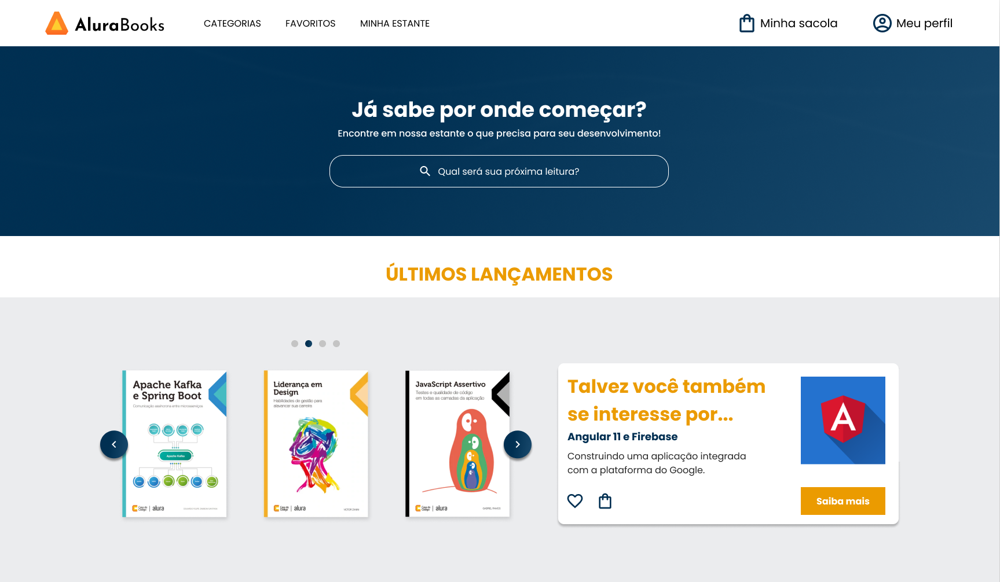

[Projeto AluraBooks](https://alisson-vml.github.io/""/)

  

## 💻 Projeto

Esse é um projeto de uma página web responsiva

## ✔️ Tecnologias utilizadas

- ``HTML``
- ``CSS``
- ``SwiperJS``

## 🏷️ Layout

Você pode visualizar o layout do projeto através
[desse link](https://www.figma.com/file/sSMbIqKaGBd66Y8roxTk2p/AluraBooks?type=design&node-id=37-94&mode=design&t=4Hy1RBfIHCcVUrVv-0).